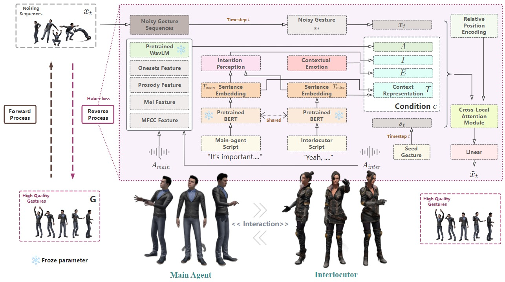

# Conversational Co-Speech Gesture Generation via Modeling Dialog Intention, Emotion, and Context with Diffusion Models

### *Haiwei Xue, Sicheng Yang, Zhensong Zhang, Zhiyong Wu, Minglei Li, Zonghong Dai, Helen Meng*

<h2 id = "1">Abstract</h2>
Audio-driven co-speech human gesture generation has made remarkable advancements recently. 
However, most previous works only focus on single person audio-driven gesture generation. 
We aim at solving the problem of conversational co-speech gesture generation that considers multiple participants in a conversation, which is a novel and challenging task due to the difficulty of simultaneously incorporating semantic information and other relevant features from both the primary speaker and the interlocutor. 
To this end, we propose CoDiffuseGesture, a diffusion model-based approach for speech-driven interaction gesture generation via modeling bilateral conversational intention, emotion, and semantic context. Our method synthesizes appropriate interactive, speech-matched, high-quality gestures for conversational motions through the intention perception module and emotion reasoning module at the sentence level by a pretrained language model. Experimental results demonstrate the promising performance of the proposed method.

    
	
    
     
    
 
    <b>Fig.1</b>: The overall diagram of the proposed approach. 
    

## Demos

<video src="./data/demo/1.mp4" controls="controls" width="100%" height="100%" autoplay="autoplay" loop="loop" muted="muted"></video>

<video src="./data/demo/2.mp4" controls="controls" width="100%" height="100%" autoplay="autoplay" loop="loop" muted="muted"></video>

<video src="./data/demo/3.mp4" controls="controls" width="100%" height="100%" autoplay="autoplay" loop="loop" muted="muted"></video>

<video src="./data/demo/4.mp4" controls="controls" width="100%" height="100%" autoplay="autoplay" loop="loop" muted="muted"></video>

<video src="./data/demo/5.mp4" controls="controls" width="100%" height="100%" autoplay="autoplay" loop="loop" muted="muted"></video>

<video src="./data/demo/6.mp4" controls="controls" width="100%" height="100%" autoplay="autoplay" loop="loop" muted="muted"></video>

<video src="./data/demo/7.mp4" controls="controls" width="100%" height="100%" autoplay="autoplay" loop="loop" muted="muted"></video>

<video src="./data/demo/8.mp4" controls="controls" width="100%" height="100%" autoplay="autoplay" loop="loop" muted="muted"></video>

<video src="./data/demo/9.mp4" controls="controls" width="100%" height="100%" autoplay="autoplay" loop="loop" muted="muted"></video>

<video src="./data/demo/10.mp4" controls="controls" width="100%" height="100%" autoplay="autoplay" loop="loop" muted="muted"></video>
